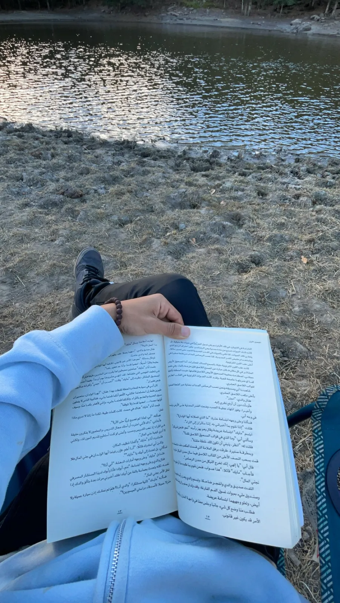

# 🌄 Amine Hiking Journal

Un journal de randonnées & d'aventures moderne, ultra-rapide et responsive, développé avec **React**, **Vite**, **TailwindCSS**, **Framer Motion** et **Supabase**.

<p align="center">
  
</p>

<p align="center">
  
  
  
  
  
</p>

---

## ✨ Aperçu & Fonctionnalités

- 🏔️ **Randonnées & Expéditions** : Visualisation détaillée des randonnées avec carte d'information (distance, altitude, durée, avis, conseils).
- 🔍 **Recherche & Filtrage** : Filtrez les randonnées par titre ou localisation instantanément.
- 🖼️ **Portfolio Galerie** : Agrégation dynamique de toutes les photos des randonnées stockées sur Supabase Storage (avec chargement progressif skeleton).
- 👁️ **Compteur de Visiteurs Public** : Compteur atomique incrémenté via une fonction RPC PostgreSQL Supabase (`increment_visits`) avec animation fluide de chiffre défilant.
- 📱 **Responsive Design (Mobile First)** : Optimisé pour tous les écrans (testé et validé à 375px mobile).
- 🔒 **Espace d'Administration** : Espace sécurisé (`/admin`) permettant à l'administrateur d'ajouter et d'uploader de nouvelles randonnées avec images directement dans le bucket Supabase `hike-images`.
- 📬 **Formulaire de Contact Pro** : Intégration EmailJS pour la réception directe de messages.
- 🌐 **SEO & Open Graph** : Balises meta SEO, Open Graph et Twitter Cards pour un partage optimal sur les réseaux sociaux.

---

## 🛠️ Tech Stack

| Élément | Technologie |
|---|---|
| **Frontend** | React 18, Vite 5, React Router DOM v6 |
| **Styles & Animations** | TailwindCSS, Framer Motion, Lucide React (Icônes SVG) |
| **Backend & Base de données** | Supabase (PostgreSQL, Storage, Auth, RLS) |
| **Formulaire & Mail** | EmailJS (`@emailjs/browser`) |
| **Déploiement** | Netlify (SPA Redirects configurés) |

---

## 🔑 Configuration des variables d'environnement (`.env`)

Pour connecter l'application à votre instance **Supabase** et à **EmailJS**, créez un fichier `.env` à la racine du projet :

```env
# URL de votre projet Supabase
VITE_SUPABASE_URL=https://votre-projet.supabase.co

# Clé anonyme publique (Anon / Public Key)
VITE_SUPABASE_ANON_KEY=eyJhbGciOiJIUzI1NiIsInR5cCI6IkpXVCJ9...

# Options EmailJS (Formulaire de contact)
VITE_EMAILJS_SERVICE_ID=service_rktp91g
VITE_EMAILJS_TEMPLATE_ID=template_x2sifvk
VITE_EMAILJS_PUBLIC_KEY=LvAfRBv6ZVDKtFUlO
```

> [!IMPORTANT]
> Ne commitez jamais votre fichier `.env` sur GitHub. Un fichier exemple `.env.example` est fourni dans le dépôt.

---

## 🗄️ Configuration de la Base de Données Supabase

1. Créez un projet gratuit sur [Supabase](https://supabase.com/).
2. Rendez-vous dans le **SQL Editor** de votre tableau de bord Supabase.
3. Copiez et exécutez l'intégralité du script SQL disponible dans [`supabase/schema.sql`](./supabase/schema.sql).

Ce script va automatiquement :
- Créer la table `hikes` avec Row Level Security (RLS).
- Créer le bucket public storage `hike-images` pour héberger les photos.
- Créer la table `visits` et la fonction RPC `increment_visits()` pour le compteur de visiteurs atomique.
- Insérer les randonnées initiales.

---

## 🚀 Installation & Lancement Local

```bash
# 1. Cloner le dépôt
git clone https://github.com/am11iin/amine-hiking-journal.git
cd amine-hiking-journal

# 2. Installer les dépendances
npm install

# 3. Configurer le fichier .env
cp .env.example .env
# Remplacez les valeurs dans .env par vos propres clés Supabase

# 4. Lancer le serveur de développement
npm run dev
```

Ouvrez ensuite votre navigateur sur `http://localhost:5173`.

---

## 📦 Build & Déploiement Production (Netlify)

Pour builder le projet :

```bash
npm run build
```

Pour tester le build localement :

```bash
npm run preview
```

### Déploiement sur Netlify :
1. Connectez votre dépôt GitHub à **Netlify**.
2. Dans **Site Settings > Environment variables**, ajoutez :
   - `VITE_SUPABASE_URL`
   - `VITE_SUPABASE_ANON_KEY`
3. Netlify va auto-déployer le projet. Les redirections SPA pour React Router sont gérées via `netlify.toml` et `public/_redirects`.

---

## 📁 Structure du Projet

```text
amine-hiking-journal/
├── public/                  # Favicon, images statiques WebP & _redirects
├── src/
│   ├── components/          # Header, Footer, HikeCard, Gallery, VisitorCounter, SkeletonLoader
│   ├── hooks/               # useHikes, useVisitorCount
│   ├── lib/                 # Client Supabase (supabaseClient.js)
│   ├── pages/               # Home, Hikes, HikeDetails, Portfolio, Contact, Admin
│   ├── App.jsx              # Configuration des routes
│   └── main.jsx             # Point d'entrée React
├── supabase/
│   └── schema.sql           # Schema complet SQL (Tables, Bucket, RPC & Policies)
├── .env.example             # Exemple de variables d'environnement
├── netlify.toml             # Configuration Netlify SPA
└── package.json
```

---

## 🤝 Social & Contact

- **Instagram** : [@_amx_ne](https://www.instagram.com/_amx_ne/)
- **TikTok** : [@_aminnnnee](https://www.tiktok.com/@_aminnnnee)
- **Strava** : [Amine sur Strava](https://strava.app.link/TnVssSHoo6b)
- **GitHub** : [@am11iin](https://github.com/am11iin)

---

*Libre d'utilisation sous licence MIT. Fait avec passion pour la montagne.* 🏔️
